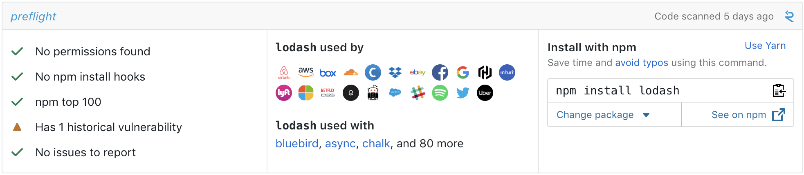
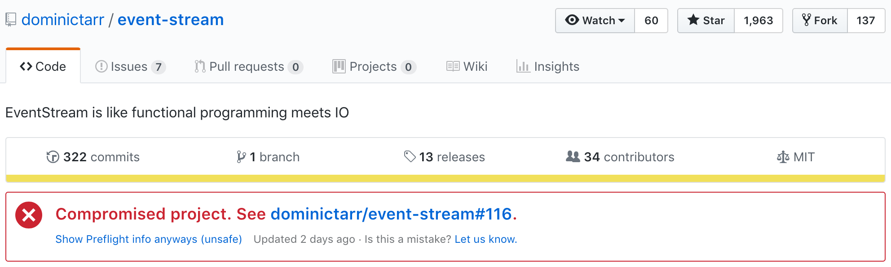

# Preflight

## Be Confident in Dependencies

Preflight measures security in code to protect you from malicious, privacy-invasive, or vulnerable dependencies.

    
    

## New Attack Vector

Attackers are finding and using issues in open-source packages to compromise software that use those packages.

* We hoped popular packages might be more secure, and that we wouldn't have to worry a package that gets 2,000,000 downloads every week. (https://twitter.com/joepie91/status/1067123980711198727)
* We thought that as long as we can review the source-code, we would be safe. (https://hackernoon.com/im-harvesting-credit-card-numbers-and-passwords-from-your-site-here-s-how-9a8cb347c5b5)
* We've read that 14% of JavaScript packages on npm could be compromised. (https://medium.com/@liran.tal/malicious-modules-what-you-need-to-know-when-installing-npm-packages-12b2f56d3685)

For communities that rely on open-source, these issues hit especially hard.

## Our mission

Preflight performs security-focused program analysis to measure and rank software across entire ecosystems. Since JavaScript has a thriving and widely-used open-source ecosystem, we're starting there. If we find anything that merits attention, we'll alert you:

## Preflight Criteria

* **Permissions:** We look at the resources a package requires to work. Does it interact with the filesystem, make network calls, or read environment variables?
* **Unsafe Methods:** We look for the use of methods that have historically caused security issues. Does the project call exec, eval, or deprecated APIs like new Buffer?
* **Install Behavior:** We check if a package executes code when npm add is run. Are they abnormal and potentially malicious (see eslint's postmortem (https://eslint.org/blog/2018/07/postmortem-for-malicious-package-publishes))
* **Popularity and Usage:** We search for social proof of a package's quality. Is it well-known or obscure? What prominent organizations or authors use it?
* **Known & Historical Vulnerabilities:** We check for known CVEs (https://en.wikipedia.org/wiki/Common_Vulnerabilities_and_Exposures). Does this package have a history of incidents and have they adopted good security practices in response?

## Committed to Security
At R2C, we are working on eliminating entire classes of vulnerabilities and bad practices by just making them easier to spot and harder to commit. We want to incentivize best practices and provide visibility into security in code!

If that sounds like a good idea, join our Beta program or better yet... [join us](https://jobs.lever.co/returntocorp/)!

We are committed to respecting and protecting your privacy. See our [Privacy Policy](../PRIVACY.md) to learn about what information we collect and how we might use that information. For information about our security policy and disclosure procedure, see our [Security Policy](../SECURITY.md).
